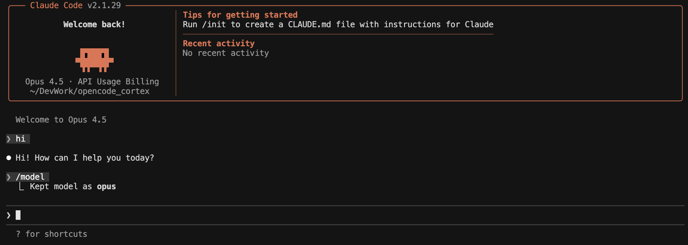
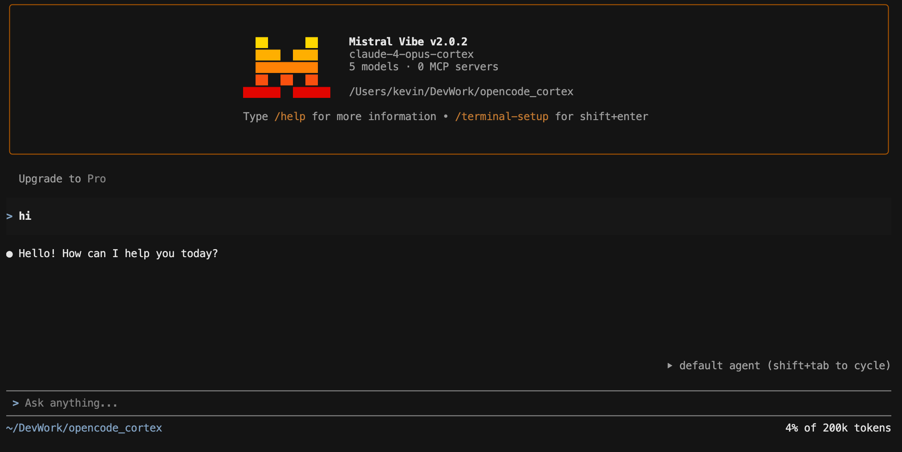
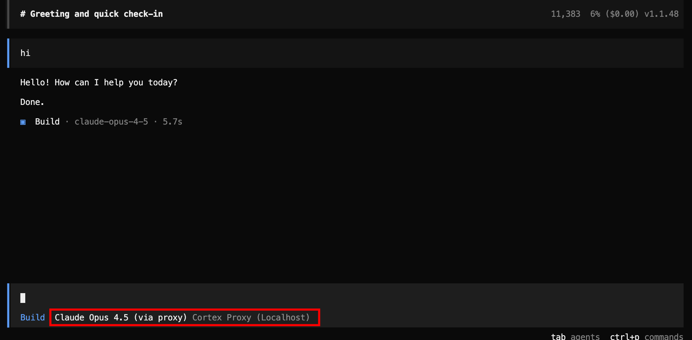
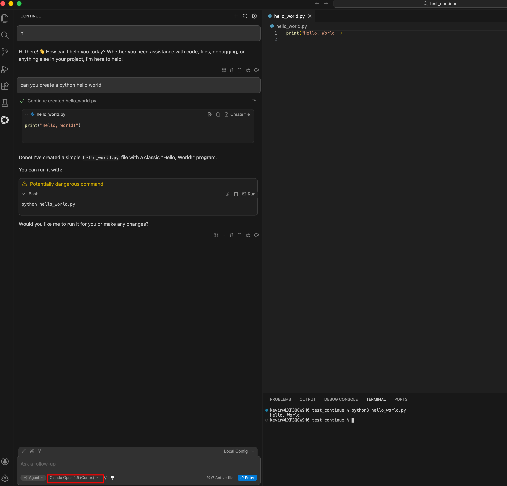

## Snowflake Cortex AI Agent Compatibility Proxy

This project adds Snowflake Cortex AI model support to any agent that uses Anthropic or OpenAI‑compatible APIs with tool calls (Claude Code, OpenCode, Continue.dev, Mistral Vibe, etc.).

Links:

- Claude Code: https://www.anthropic.com/claude-code
- OpenCode: https://opencode.ai
- Continue.dev: https://continue.dev
- Mistral: https://mistral.ai

It includes a high‑performance Rust proxy that translates:

- **Anthropic** `/v1/messages` → Snowflake Cortex `/chat/completions`
- **OpenAI** `/chat/completions` → Snowflake Cortex `/chat/completions`

It supports streaming responses and tool calls, and maps `max_tokens` to `max_completion_tokens`.

### Why this exists

This proxy lets you use any coding agent you prefer while centralizing inference in Snowflake Cortex, keeping AI and data governance in the Snowflake Horizon catalog.

 In combination with the Snowflake MCP server integrations these agents can also access further Snowflake native capabilities and data without leaving the Snowflake security perimeter.
 
 Finally you get centralized billing across all models Snowflake supports.

```
                    +---------------------------+
                    |   Coding Agents / IDEs   |
                    |  Claude Code / OpenCode  |
                    |  Continue / Mistral Vibe |
                    +-------------+-------------+
                                  |
                                  v
                         +------------------+
                         |  Cortex Proxy    |
                         |  OpenAI/Anthropic|
                         +--------+---------+
                                  |
                                  v
         +------------------------+------------------------+
         |        Snowflake Cortex (LLM Inference)         |
         |  Models + Governance + Centralized Billing      |
         +------------------------+------------------------+
                                  |
                                  v
         +------------------------+------------------------+
         |   Snowflake MCP Servers (Native Integrations)   |
         |   Horizon Security Perimeter + Data Controls    |
         +-------------------------------------------------+
```

### Quick start

### Install (scripts)

#### macOS / Linux

```bash
curl -sSLO https://raw.githubusercontent.com/sfc-gh-kkeller/snowflake_cortex_ai_proxy/main/install.sh
chmod +x install.sh
./install.sh
```

#### Windows (PowerShell)

```powershell
Invoke-WebRequest -Uri "https://raw.githubusercontent.com/sfc-gh-kkeller/snowflake_cortex_ai_proxy/main/install.bat" -OutFile "install.bat"
.\install.bat
```

After install, edit the generated config at `~/.config/cortex-proxy/config.toml` (or `%USERPROFILE%\.config\cortex-proxy\config.toml` on Windows) and set your Snowflake `base_url`, `pat`, and `default_model`.

### Manual install (download from releases)

You can also download the binary for your platform from the GitHub Releases page and install it manually.

Steps:
1) Download the archive that matches your OS/arch from:
   https://github.com/sfc-gh-kkeller/snowflake_cortex_ai_proxy/releases
2) Extract the `cortex-proxy` (or `cortex-proxy.exe`) binary.
3) Move it into a directory on your PATH:
   - macOS/Linux: `~/.local/bin`
   - Windows: `%USERPROFILE%\bin`
4) Create a config file at:
   - macOS/Linux: `~/.config/cortex-proxy/config.toml`
   - Windows: `%USERPROFILE%\.config\cortex-proxy\config.toml`
5) Copy the sample config `cortex-proxy.example.toml` and edit:
   - `snowflake.base_url`
   - `snowflake.pat`
   - `snowflake.default_model`
6) Run: `cortex-proxy --config <path-to-config>`

```bash
cd cortex-proxy-rs
cargo build --release
```

Create a config file (do **not** commit your PAT). Default model is `claude-opus-4-5`.

Sample `cortex-proxy.toml`:

```toml
[proxy]
port = 8766
log_level = "info"
timeout_secs = 300
connection_pool_size = 10

[snowflake]
base_url = "https://<account>.snowflakecomputing.com/api/v2/cortex/v1"
pat = "<YOUR_PAT>"
default_model = "claude-opus-4-5"

[model_map]
# Optional: client model name -> Snowflake model name
# "claude-opus-4-5" = "claude-opus-4-5"
# "claude-4-opus" = "claude-opus-4-5"
```

Run the proxy:

```bash
./target/release/cortex-proxy --config /path/to/config.toml
```

### Env vars (for testing)

The proxy itself only reads `CORTEX_PROXY_CONFIG`. Most clients still require an API key env var, but the proxy ignores it.

```bash
# Proxy config (optional if using default search order)
export CORTEX_PROXY_CONFIG=/path/to/config.toml

# Anthropic-compatible clients (Claude Code, etc.)
export ANTHROPIC_BASE_URL=http://localhost:8766
export ANTHROPIC_API_KEY=dummy-key-proxy-handles-auth

# OpenAI-compatible clients
export OPENAI_BASE_URL=http://localhost:8766
export OPENAI_API_KEY=dummy-key-proxy-handles-auth
```

Snowflake Cortex model IDs for Opus (from the Cortex REST API docs):
- `claude-4-opus` (Opus 4)
- `claude-opus-4-5` (Opus 4.5)

### Claude Code (via proxy)

After setting the `ANTHROPIC_BASE_URL` and `ANTHROPIC_API_KEY` env vars above, launch Claude Code and select your Claude model.



### Mistral Vibe (use the proxy)

Mistral Vibe reads `config.toml` from `./.vibe/config.toml` or `~/.vibe/config.toml`.

Add a proxy provider + model, then set the active model (use a model your Snowflake account is allowed to access):

```toml
[[providers]]
name = "cortex-proxy"
api_base = "http://localhost:8766"
api_key_env_var = "CORTEX_PROXY_API_KEY"
api_style = "openai"
backend = "generic"

[[models]]
name = "claude-opus-4-5"
provider = "cortex-proxy"
alias = "claude-opus-4-5-cortex"
temperature = 0.2
input_price = 0.0
output_price = 0.0

active_model = "claude-opus-4-5-cortex"
```

Then set a dummy API key (the proxy ignores it):

```bash
export CORTEX_PROXY_API_KEY=dummy-key-proxy-handles-auth
```

If you see `403 Forbidden` with `Model <name> not allowed`, switch to a model your Snowflake account has access to (e.g., `claude-4-sonnet`).



### Test Claude (Anthropic API)

With the proxy running, send a simple Anthropic-style request to `localhost:8766`:

```bash
curl -sS http://localhost:8766/v1/messages \
  -H "Content-Type: application/json" \
  -H "x-api-key: dummy" \
  -H "anthropic-version: 2023-06-01" \
  -d '{"model":"claude-opus-4-5","max_tokens":128,"messages":[{"role":"user","content":"Say hi from the Cortex proxy."}]}'
```

Expected response includes a `message` with Claude output and a mapped model like `claude-opus-4-5`.

### Test OpenAI-compatible API

```bash
curl -sS http://localhost:8766/chat/completions \
  -H "Content-Type: application/json" \
  -H "Authorization: Bearer dummy" \
  -d '{"model":"claude-opus-4-5","messages":[{"role":"user","content":"Say hi from the Cortex proxy."}],"max_tokens":128}'
```

Expected response includes a `choices[0].message` with Claude output and a mapped model like `claude-opus-4-5`.

### Use with OpenCode (local proxy)

Add a provider entry pointing to the proxy in your global config:

```jsonc
{
  "provider": {
    "cortex-proxy": {
      "npm": "@ai-sdk/openai-compatible",
      "name": "Cortex Proxy (Localhost)",
      "options": {
        "baseURL": "http://localhost:8766",
        "apiKey": "local"
      },
      "models": {
        "claude-4-opus": { "name": "Claude 4 Opus (via proxy)", "tool_call": true, "attachment": true },
        "claude-4-sonnet": { "name": "Claude 4 Sonnet (via proxy)", "tool_call": true, "attachment": true }
      }
    }
  },
  "model": "cortex-proxy/claude-4-opus"
}
```

Then run:

```bash
opencode
```



### Continue.dev example

```yaml
name: Snowflake Cortex Config
version: 1.0.0
schema: v1

models:
  - name: Claude Opus 4.5 (Cortex)
    provider: openai
    model: claude-opus-4-5
    apiBase: http://localhost:8766
    apiKey: dummy-key-proxy-handles-auth
    useLegacyCompletionsEndpoint: false
    roles:
      - chat
      - edit
      - apply
    capabilities:
      - tool_use

  - name: Claude 4 Sonnet (Cortex)
    provider: openai
    model: claude-4-sonnet
    apiBase: http://localhost:8766
    apiKey: dummy-key-proxy-handles-auth
    useLegacyCompletionsEndpoint: false
    roles:
      - chat
      - edit
      - apply
    capabilities:
      - tool_use

  - name: Claude 3.5 Sonnet (Cortex)
    provider: openai
    model: claude-3-5-sonnet
    apiBase: http://localhost:8766
    apiKey: dummy-key-proxy-handles-auth
    useLegacyCompletionsEndpoint: false
    roles:
      - chat
      - edit
      - apply
    capabilities:
      - tool_use

  - name: Claude Haiku 4.5 (Cortex)
    provider: openai
    model: claude-haiku-4-5
    apiBase: http://localhost:8766
    apiKey: dummy-key-proxy-handles-auth
    useLegacyCompletionsEndpoint: false
    roles:
      - chat
      - edit
      - apply
      - autocomplete
    capabilities:
      - tool_use

tabAutocompleteModel:
  provider: openai
  model: claude-haiku-4-5
  apiBase: http://localhost:8766
  apiKey: dummy-key-proxy-handles-auth
  useLegacyCompletionsEndpoint: false
```



### Config file search order

- `~/.config/cortex-proxy/config.toml`
- `./cortex-proxy.toml`
- or pass `--config` / `CORTEX_PROXY_CONFIG`
